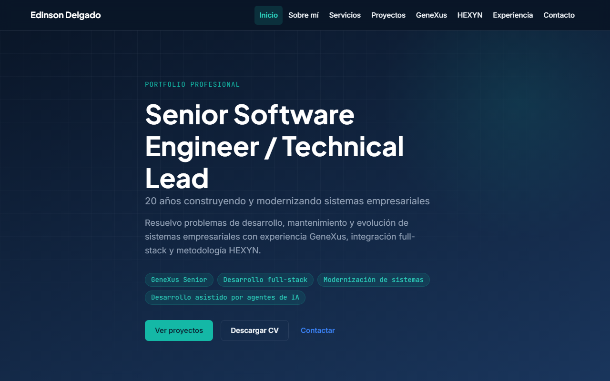

# Portfolio — Edinson Delgado

Sitio profesional estático para presentar la trayectoria, proyectos y servicios de **Edinson Delgado** — Senior Software Engineer / Technical Lead con 20 años construyendo y modernizando sistemas empresariales.

Objetivo: convertir experiencia real en evidencia verificable para oportunidades laborales, contratos como contractor y clientes propios.

| | |
|--|--|
| **Sitio en producción** | [https://edinson.proyectocolmena.com](https://edinson.proyectocolmena.com) |
| **Repositorio** | [github.com/didier15774/portfolio-edinson-delgado](https://github.com/didier15774/portfolio-edinson-delgado) |
| **Versión** | `v1.0.0` |



---

## Descripción profesional

El visitante debe comprender en segundos qué problemas resuelve Edinson, qué sistemas ha construido y cómo contactarlo. El sitio combina:

- Identidad visual tecnológica (azul marino / turquesa, modo oscuro principal).
- Tres recorridos compartibles (`/genexus/`, `/modernizacion/`, `/innovacion/`) en un solo producto.
- Casos de estudio extensibles, metodología HEXYN y formulario de contacto seguro.

---

## Stack

| Capa | Tecnología |
|------|------------|
| Framework | Astro 7.2 — SSG (`output: static`) |
| Lenguaje | TypeScript (strict) |
| Estilos | CSS con variables de diseño (sin Tailwind) |
| Contenido | Content Collections (Markdown + Zod) |
| Contacto | PHP + SMTP Hostinger (`api/contact.php`) |
| Hosting | Hostinger — `dist/` → `public_html` |

Sin React, Vue, Next.js ni base de datos en v1.

---

## Rutas principales

```
/                          Inicio
/sobre-mi/                 Perfil profesional
/servicios/                Servicios
/proyectos/                Índice de casos
/proyectos/aprobar/        Caso AProbar
/proyectos/clicks/         Caso Clicks
/proyectos/colmena/        Caso Colmena
/genexus/                  Recorrido Nivel 1
/modernizacion/            Recorrido Nivel 2
/innovacion/               Recorrido Nivel 3
/hexyn/                    Metodología HEXYN
/experiencia/              Timeline profesional
/contacto/                 Formulario + canales directos
/cv/                       Descarga de CV (PDF)
```

---

## Instalación local

**Requisitos:** Node.js ≥ 22.12, npm ≥ 10

```bash
git clone https://github.com/didier15774/portfolio-edinson-delgado.git
cd portfolio-edinson-delgado
cp .env.example .env
npm install
npm run dev
```

Abrir http://localhost:4321 — no abrir `dist/index.html` con `file://` (los CSS viven en `/_astro/`).

---

## Build y despliegue

```bash
# Build productivo (SEO + sitemap con dominio real)
npm run build:prod
npm test
npm run check

# Despliegue automatizado a Hostinger (Windows)
Deploy\validate_remote.bat
Deploy\build_Production.bat
Deploy\deploy_Production.bat
```

Documentación:

- [Deploy/docs/DEPLOY_PROCESS.md](./Deploy/docs/DEPLOY_PROCESS.md)
- [docs/CHECKLIST_PRODUCCION.md](./docs/CHECKLIST_PRODUCCION.md)
- [docs/SMTP_HOSTINGER.md](./docs/SMTP_HOSTINGER.md)

**Secretos fuera del repo:** `.env`, `Deploy/deploy.config.ps1`, `api/contact.config.php` (solo en el servidor).

---

## Estado

| Área | Estado |
|------|--------|
| Sitio estático (15 rutas) | En producción |
| Dominio | https://edinson.proyectocolmena.com |
| Formulario + SMTP | Código listo — configurar `contact.config.php` en Hostinger |
| Recomendaciones | Estructura lista — sección oculta hasta autorizaciones |
| Capturas de proyectos | Pendientes |

---

## Documentación

| Documento | Contenido |
|-----------|-----------|
| [AGENTS.md](./AGENTS.md) | Guía para agentes |
| [docs/PRODUCT.md](./docs/PRODUCT.md) | Producto y mapa del sitio |
| [docs/ARCHITECTURE.md](./docs/ARCHITECTURE.md) | Arquitectura |
| [docs/SECURITY.md](./docs/SECURITY.md) | Seguridad del formulario |
| [docs/DEPLOYMENT_HOSTINGER.md](./docs/DEPLOYMENT_HOSTINGER.md) | Despliegue |

---

## Contacto

- **Edinson Delgado** — [it.edelgado@gmail.com](mailto:it.edelgado@gmail.com)
- [LinkedIn](https://www.linkedin.com/in/edinsondelgado/)
- [GitHub](https://github.com/didier15774)

---

## Licencia

Contenido y código propiedad de Edinson Delgado. Dependencias sujetas a sus licencias respectivas.
